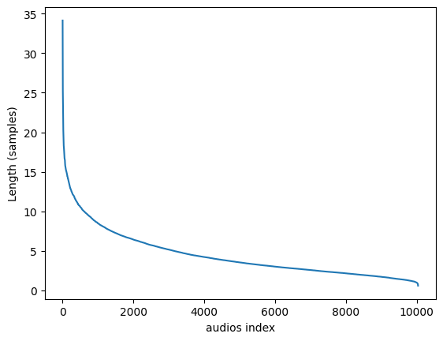
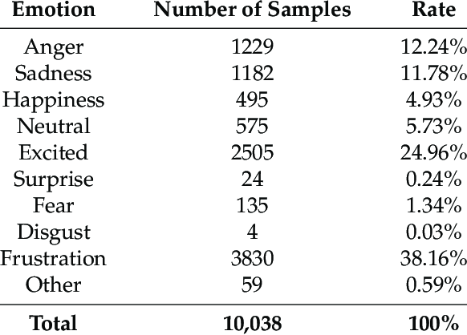
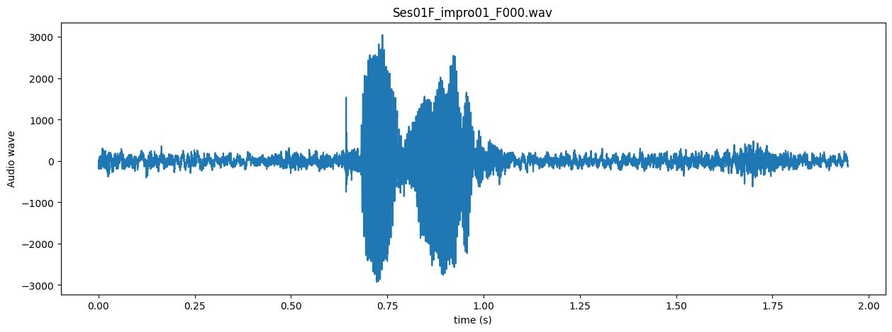
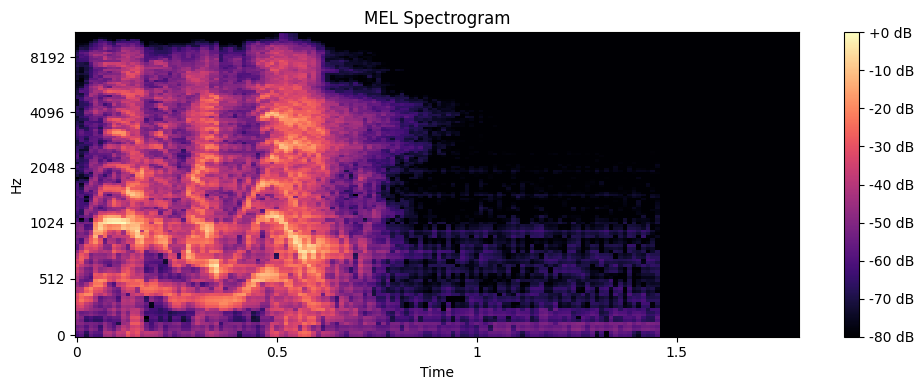

# AudioMood

 
This project aims to develop a language-agnostic AI that can detect emotions through audio accurately.
It also is a documentation of my learning journey, the models presented here reflect my evolving knowledge throughout the project.

A Project made possible thanks to [**The Ryerson Audio-Visual Database of Emotional Speech and Song (RAVDESS)**](https://zenodo.org/record/1188976) and [**The Interactive Emotional Dyadic Motion Capture (IEMOCAP) Database**](https://sail.usc.edu/iemocap/index.html) allowing me to work with ~20 Gb worth of audio and video files. I aim for this project to be applicable to any language worldwide, without requiring translation. One possible application of this technology could be generating subtitles that describe the emotions conveyed by the speaker more accurately.

## A more in depth description  

### The datasets 
#### IEMOCAP Dataset
This dataset contains english conversational recordings between a man and a woman, spanning ~20 Gb in size . Each conversation (from 3 to 5 minutes long) is conveniently segmented into multiple short audio file, typically lasting around 5 seconds (its high variation in length makes it hard to work with). 

Furthermore, each audio clip represents a brief utterance by one of the characters. With an abundance of such short audio clips, I can feed my model(s) a rich array of diverse samples for training and achieve superior performance in emotion recognition. (At least I hope so)
The emotions of each short clip are annotated along with their respective reaction, enabling us to establish a clear association between each clip and its corresponding emotion label.

  

#### RAVDESS Dataset
This Dataset contains 24 professional actors (12 female, 12 male), vocalizing two lexically-matched statements in a neutral North American accent. The fact that there are so little variations in length between each files makes it really easy to pre-process the data.
Speech includes calm, happy, sad, angry, fearful, surprise, and disgust expressions, and song contains calm, happy, sad, angry, and fearful emotions. Each expression is produced at two levels of emotional intensity (normal, strong), with an additional neutral expression, spanning ~500 Mb in size which is very small compared to the IEMOCAB dataset.

### The model(s)
Every models implemented in this project utilize Convolutional Neural Networks (CNN) for identifying emotional patterns in audio data through image classification, primarily using Mel-spectrograms.

Initially, every .wav audio file is imported as a 1D array representing its respective audio wave :

</a>

Then, the Fourier transform function is applied to each audio wave to obtain an array of Mel-spectrograms. These Mel-spectrograms are essentially graphical representations of the audio signals that can be used as input to the AI.

By analyzing these Mel-spectrograms, the CNN can learn to identify emotional patterns and make predictions about the emotions conveyed in the audio data.

  

Each of the CNN models in this project incorporates a unique logic and solution to help the project achieve its goals. To provide a comprehensive understanding of each model's approach and design, I have provided detailed explanations in their respective files. You can access these files through the following links : 
 - [IEMOCAP CNN Model 1](https://github.com/MunznerLouis/AudioMood_private/tree/main/models/IEMOCAP_model1) - **40% acc.** *extremly biased*
 - [IEMOCAP CNN Model 2](https://github.com/MunznerLouis/AudioMood_private/tree/main/models/IEMOCAP_model2) - **30% acc.** *hypothesis : lack of data + poor data extraction*
 - [RAVDESS CNN Model 1](https://github.com/MunznerLouis/AudioMood_private/tree/main/models/RAVDESS_model1) - **60% acc.**
 - [RAVDESS CNN+LSTM Model 1](https://github.com/MunznerLouis/AudioMood_private/tree/main/models/RAVDESS_model2) - *in progress*

 By reviewing these explanations, you will gain insight into the specific methods and techniques used in each model, and how they contribute to the overall project in addition to my learning process.

## Getting Started

### Installing - WIP

Not available yet

### Using the model - WIP

Not available yet

## Contact me

 Louis Münzner : munzner.louis@gmail.com

## License

This project is licensed under the MIT License - see the [LICENSE.md](https://github.com/MunznerLouis/AudioMood/blob/main/LICENSE) file for details.

## Acknowledgments  

* [The Interactive Emotional Dyadic Motion Capture (IEMOCAP) Database](https://sail.usc.edu/iemocap/index.html)
* [The Ryerson Audio-Visual Database of Emotional Speech and Song (RAVDESS)](https://zenodo.org/record/1188976)
